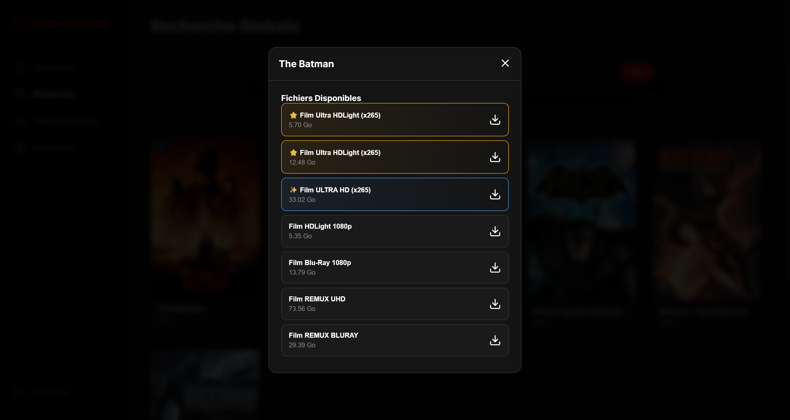

# 🐍 Hydr'Hacked 
> [!IMPORTANT]
> Merci de bien lire tout ça avant de déployer le server


> "Un immense merci à l'équipe technique d'Hydracker pour sa générosité. On a trouvé votre API tellement 'ouverte d'esprit' qu'on s'est permis de l'aider à partager ses liens sans les contraintes futiles d'un navigateur ou d'un abonnement. C'est presque trop facile, mais comme on dit : c'est l'intention qui compte." 💅

---

## 🚀 Présentation

**Hydr'Hacked** est une solution complète (Serveur API + Interface Web) pour crawler, rechercher et télécharger du contenu depuis **Zone-Telechargement** (par défaut) ou **Hydracker** (en option). 

> [!IMPORTANT]
> **Nouveauté :** L'application utilise désormais **Zone-Telechargement** comme source principale. 
> Cela signifie que la recherche, les tendances, les films ET les séries sont désormais **100% gratuits et sans aucun token**. 
> Hydracker reste disponible comme source secondaire dans les paramètres si vous possédez un token.

## ✨ Fonctionnalités

- 🔍 **Recherche & Tendances** : Chercher vos films et séries ou récupérer les tendances.
- 💻 **Interface web** : Interface web moderne et responsive (Dark Mode, animations fluides).
- 🔗 **Affichage des liens** : Copier-coller le lien final s'affiche en un clic. 
- ⚡ **Intégration JDownloader** : Envoi automatique des liens vers votre instance JDownloader (si activé dans les paramètres).

## 🔑 Ce qui nécessite (ou pas) un token

| Fonctionnalité | 100% gratuit |
|---|---|
| 🔍 Recherche | ✅ Gratuit (ZT) |
| 🔥 Tendances | ✅ Gratuit (ZT) |
| 🎬 Films (liens 1fichier) | ✅ Gratuit (ZT) |
| 🖼️ Affiches (posters) | ✅ Gratuit (proxy intégré) |
| 📺 Séries (liens 1fichier) | ✅ Gratuit (via ZT) |


---

## 📸 Screenshots

### Interface Web


### Qualités




---
## 🛠️ Installation

### 🐳 Via Docker (Recommandé)

C'est la méthode la plus simple pour garder un environnement propre.

```bash
# 1. Cloner le projet (si ce n'est pas déjà fait)
git clone https://github.com/NoNoBzH22/Hydr-Hacked

# 2. Préparer la configuration
cp .env.example .env

# 3. Lancer l'application
docker compose up -d --build
```
📍 Accès : `http://localhost:3067`

---

### 💻 Installation Manuelle
Pour ceux qui préfèrent une installation classique.

**Prérequis :** [Node.js](https://nodejs.org/) v20+

```bash
# 1. Préparer la configuration
cp .env.example .env

# 2. Lancer l'application (installe et compile automatiquement)
make start
```

> [!TIP]
> Si vous n'avez pas `make`, vous pouvez utiliser : `npm run build && npm start`.
> Pour le développement avec rechargement automatique, utilisez : `make dev` (ou `npm run dev`).

---

### ⚙️ Configuration (.env)

Créez un fichier `.env` à la racine du projet et configurez les variables suivantes :

| Variable | Type | Description |
|---|---|---|
| `ZT_URL` | **Requis** | URL complète du site Zone-Telechargement. |
| `HYDRACKER_URL` | Optionnel | URL complète de votre instance Hydracker (nécessaire si plugin actif). |
| `API_PASSWORD` | **Requis** | Mot de passe pour l'écran de connexion initial. |
| `SECRET` | **Requis** | Clé secrète pour les sessions. |
| `HYDRACKER_API_KEY` | Optionnel | Votre token Hydracker. |
| `PORT` | Optionnel | Port de l'application (Défaut : `3067`). |
| `JD_HOST` | Optionnel | IP/Hôte de JDownloader. |
| `JD_API_PORT` | Optionnel | Port API de JDownloader (Défaut : `3128`). |

> [!WARNING]
> **`ZT_URL` et `HYDRACKER_URL` ne sont volontairement pas renseignées par défaut**. Vous devez les remplir vous-même avec les URLs des sites sources respectifs.

> [!TIP]
> **Comment obtenir ma `HYDRACKER_API_KEY` ?**
> Connectez-vous sur votre instance Hydracker, cherchez la page **Paramètres du compte** et descendez jusqu'à **Jetons d'accès API**. 
> Cliquez sur **Créer un jeton** et copiez le token généré dans le champ `HYDRACKER_API_KEY` de votre `.env`.


## 🧩 Créer un nouveau Plugin

L'architecture d'Hydr'Hacked est modulaire. Vous pouvez facilement ajouter une nouvelle source en créant un plugin qui implémente l'interface `ISource`.

### 1. Structure
Créez un dossier dans `plugins/[NomDeVotreSource]/`. Vous aurez généralement besoin de :
- `index.ts` : Point d'entrée et implémentation de la classe.
- `api.ts` : Fonctions d'appels réseau.
- `parser.ts` : Logique d'extraction des données (Cheerio, JSON, etc.).

### 2. Implémentation
Votre classe doit implémenter `ISource` (`src/types/source.ts`) :

```typescript
export interface ISource {
    name: string;
    healthCheck(): Promise<boolean>;
    search(query: string, mediaType?: MediaType): Promise<SearchResult[]>;
    getTrending(mediaType: MediaType): Promise<SearchResult[]>;
    getSelection(identifier: string, type?: string, seasonValue?: string | number): Promise<SelectionData>;
    resolveLink?(linkId: string): Promise<string | null>; // Optionnel
}
```

### 3. Enregistrement
À la fin de votre fichier `index.ts`, enregistrez votre source :
```typescript
sourceRegistry.register(new VotrePluginAPI(CONFIG.VOTRE_URL));
```

Le serveur découvrira et chargera automatiquement votre plugin au démarrage.

## 🤝 Un Projet Communautaire
**Hydr'Hacked** est un projet fait par la communauté, pour la communauté. Parce que le savoir (et les liens de téléchargement) ne devrait jamais être prisonnier derrière des murs de paye ou des scripts de sécurité mal conçus. 
Chaque Pull Request est la bienvenue, tant qu'elle contribue à rendre l'accès encore plus fluide et... disons, "généreux".


## 📜 Licence
Projet sous licence MIT. Faites-en bon usage (ou pas, on ne juge pas).
